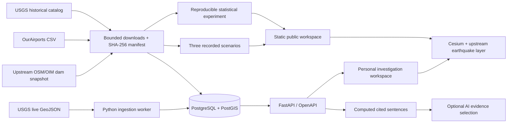

# Architecture and interfaces

The original workspace lives under `observatory/`. The upstream application is retained at the repository root and runs separately on port 4173. The investigation app runs on 4180. Shared code is the Cesium earthquake layer and its replaceable snapshot-source contract, plus the dam source data. A default-preserving symbol/opacity option is the only earthquake renderer change.

## Modes

- Public production builds are static. Data, country outlines, and Cesium's low-resolution Natural Earth imagery are bundled. No runtime feed or paid model is needed. Personal controls are hidden in production. Provider credentials are never accepted by the public page.
- Local development exposes an explicit live-mode control. The Vite proxy routes `/api` to loopback FastAPI. A failed refresh retains prior observations and displays an error; the feed-health response carries last success, last attempt, error, and staleness.
- Recorded cases are event-time replays of the retrieved catalog revision. Current reference infrastructure is not presented as an inventory from the earthquake date.

## Data dictionary

| Record | Fields and meaning |
|---|---|
| Event | `id`: USGS source ID; `time`, `updated`: Unix milliseconds UTC; `magnitude`; `depth_km`; `lon`, `lat`: WGS84 degrees; `source_url`; `retrieved_at`: ingestion timestamp; `raw`: original feature, omitted from read API |
| Event revision | `(event_id, updated)` key; full normalized and raw record. Older arrivals never replace newer current records. |
| Asset | `id`: source-prefixed identity; `kind`: airport/dam; representative `lon`, `lat`; `source_url`; `dataset_date`; `coverage` |
| Relationship | `relation=nearby`; `distance_km`; `method`; event and asset evidence IDs. Public demo uses spherical great-circle distance; live backend uses WGS84 spheroid geography. Small differences are expected. |
| Analysis row | Anchor ID, magnitude, depth, event time, 24h/7d subsequent counts, overlapping-window flag, preceding-anchor flag |
| Preferences | Version 1; layer flags, inspector visibility, radius, source-ID watchlist, named camera positions. Browser-local with validated JSON import/export. |
| AI budget | UTC month plus cumulative conservative cost reservations. Atomic conditional database update prevents concurrent overspending of the configured reservation pool. |

## API

Run locally, then visit `http://127.0.0.1:8000/docs` for OpenAPI:

- `GET /api/events?start=&end=&magnitude=&limit=&offset=` — UTC millisecond filters; maximum page size 10,000.
- `GET /api/events/{id}` — details; 404 for unknown events.
- `GET /api/events/{id}/nearby?radius=100` — complete radius result, maximum 500 km.
- `GET /api/events/{id}/relationships?radius=100` — nodes plus evidence-linked edges.
- `GET /api/events/{id}/briefing?radius=100` — deterministic facts.
- `POST /api/events/{id}/briefing?radius=100` — optional model curation, with `X-Observatory-Local: 1`. Browser origins restricted to the local workspace. No unrestricted prose is accepted from the model.
- `GET /api/analysis` — frozen experiment output.
- `GET /api/health` — database and feed freshness; 503 if database is unavailable.

## Statistical contract

Anchors: M≥5, 2021-01-01 inclusive to 2026-01-01 exclusive. Candidates: M≥4.5, strictly later than anchor, within 100 km inclusive, up to 24 hours/seven days inclusive. Download coverage begins December 24, 2020 and ends January 8, 2026. Exclude anchors without complete prior/future seven-day coverage. Same-time events are not counted as subsequent events. Deduplicate by source ID, retaining the newest revision.

Compute averaged-tie Spearman coefficients for magnitude/depth versus both counts. Constant or fewer-than-three-point series return null. Sensitivity excludes anchors with a prior M≥5 within 100 km and seven days. Do not infer causation, predict damage, or label every nearby event an aftershock. No independent-sample p-values are reported for dependent windows.

## Deliberate limits

No user accounts, public live backend, notification delivery, news ingestion, damage estimation, historical aviation effects, or earthquake forecasting. Dam coverage is a 704-feature subset, not a global inventory. Airport coverage includes large and medium airports. The public site's model briefings are precomputed factual summaries; real-provider AI is optional and must be tested with the selected provider before claiming production evaluation.
